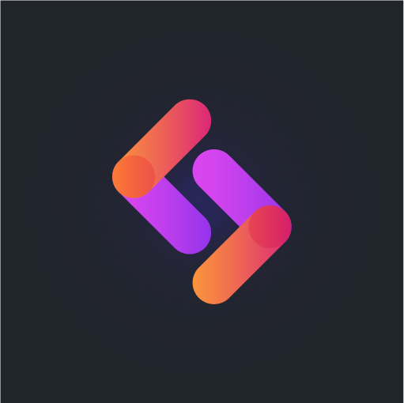

<div align="center">
  <a href="https://algolia-coding-events.vercel.app/">
    
  </a>
</div>

<br />

<div align="center">
  <strong style="color:#20242B; font-family: 'Poppins'; font-size: 3em; letter-spacing: -4px;">CodingLab</strong>
  <br />
</div>

## Strapi Backend

Strapi backend for CodingLab NextJS App.

The frontend can be found [here](https://github.com/Ekeu/algolia-coding-events)

## How to set it up

- I make use of [Cloudinary](https://cloudinary.com/) to handle images
- I make use of [strapi-hook-algolia](https://www.npmjs.com/package/strapi-hook-algolia) to synchronise my data with [Algolia](https://www.algolia.com/)

Create and add in your `.env` file your Cloudinary and Algolia Keys

```env
CLOUDINARY_NAME="xxxxxx"
CLOUDINARY_KEY="xxxxxx"
CLOUDINARY_SECRET="xxxxxx"
ALGOLIA_APPLICATION_ID="xxxxxx"
ALGOLIA_API_KEY="xxxxxx"
```

## Start your Server

 ```npm
 npm run develop

 or

 yarn develop
 ```

Open your browser and go to http://localhost:1337/admin to access the CMS.
